# SurakshitAblaagh - Mermaid Diagrams

## 1. High-Level Architecture Diagram

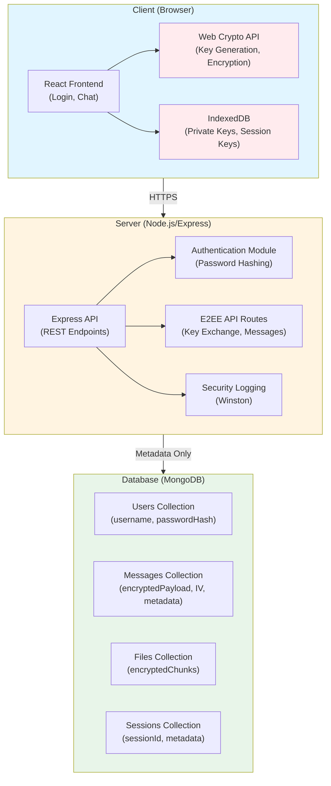

## 2. Client-Side Flow Diagrams

### 2.1 User Registration Flow

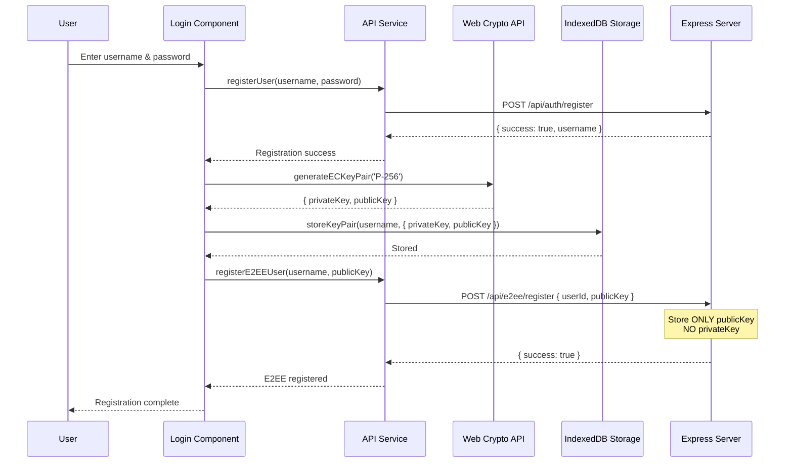

### 2.2 Key Generation and Storage Flow

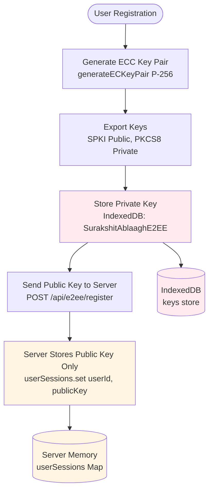

### 2.3 Message Encryption Flow (Client-Side)

```mermaid
flowchart LR
    Input[User Input<br/>Plaintext Message] --> GetKey[Get Session Key<br/>from IndexedDB]
    GetKey --> GenIV[Generate Fresh IV<br/>crypto.getRandomValues 12 bytes]
    GenIV --> GenNonce[Generate Nonce<br/>crypto.getRandomValues 16 bytes]
    GenNonce --> IncSeq[Increment Sequence Number<br/>messageCounters Map]
    IncSeq --> Encrypt[AES-256-GCM Encrypt<br/>Web Crypto API]
    Encrypt --> CreateMsg["Create Message Structure<br/>encryptedPayload, iv, authTag, nonce, sequenceNumber"]
    CreateMsg --> Send[Send to Server<br/>POST /api/e2ee/message/send]
    Send --> Server[(Server Storage<br/>NO plaintext)]
    
    style Input fill:#e1f5ff
    style Encrypt fill:#ffebee
    style Server fill:#fff4e1
```

### 2.4 File Encryption Flow (Client-Side)

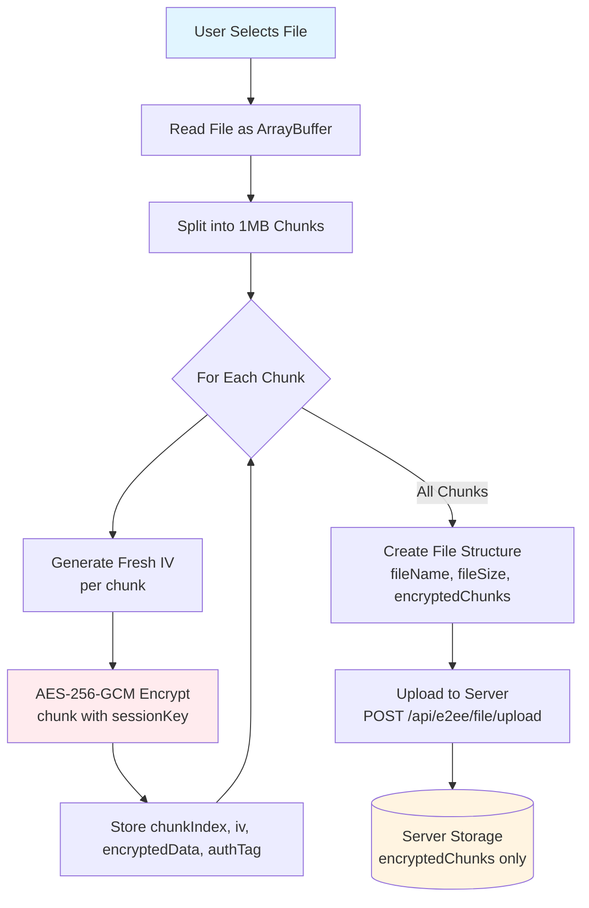

## 3. Key Exchange Protocol Diagrams

### 3.1 Complete Key Exchange Protocol Flow

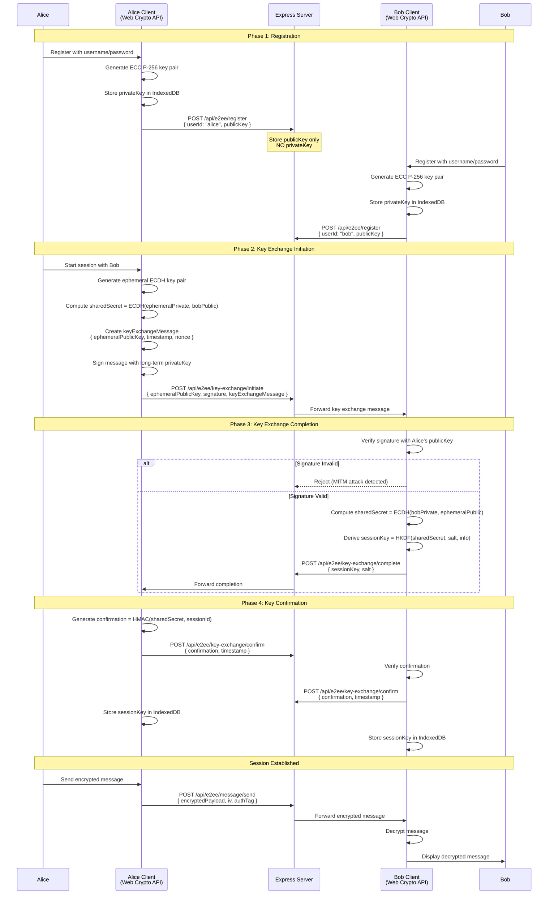

### 3.2 Key Exchange Message Flow

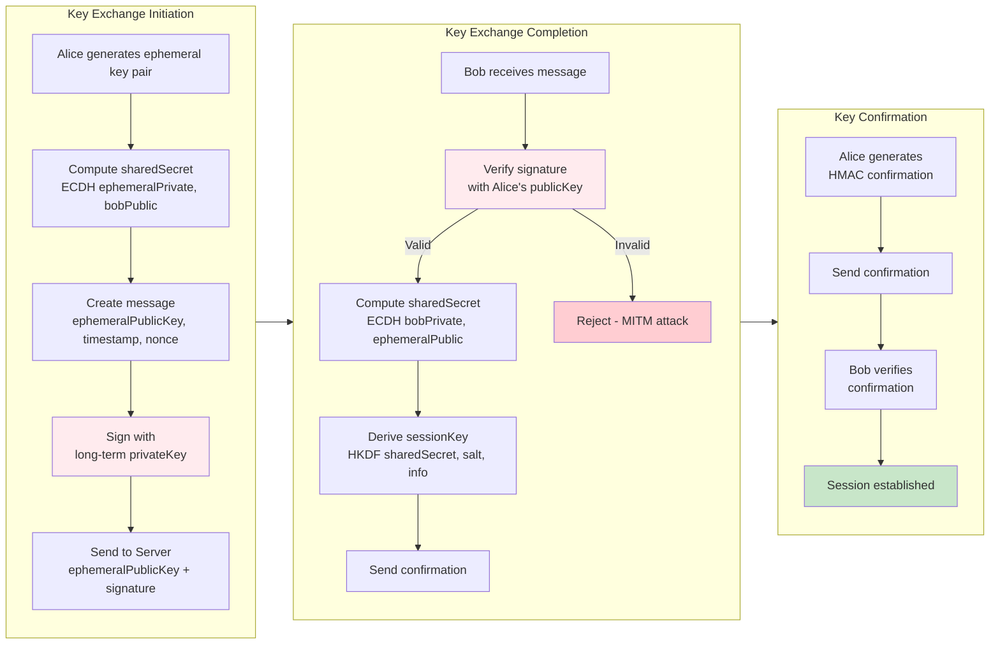

## 4. Encryption/Decryption Workflows

### 4.1 Message Encryption Workflow

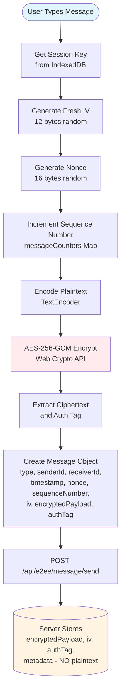

### 4.2 Message Decryption Workflow

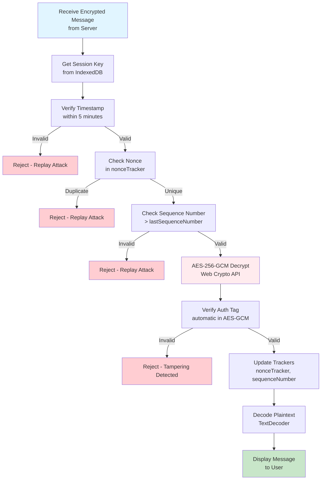

### 4.3 File Encryption/Decryption Workflow

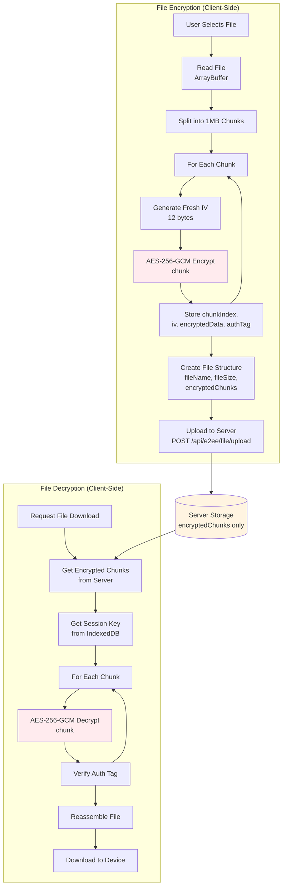

## 5. Schema Design

### 5.1 Database Schema (MongoDB)

```mermaid
erDiagram
    USERS ||--o{ MESSAGES : sends
    USERS ||--o{ FILES : sends
    USERS ||--o{ SESSIONS : has
    
    USERS {
        string username PK
        string passwordHash
        string passwordSalt
        number passwordIterations
        date createdAt
        date lastLogin
        number failedLoginAttempts
        date lockedUntil
    }
    
    MESSAGES {
        string messageId PK
        string senderId FK
        string receiverId FK
        array encryptedPayload
        array iv
        array authTag
        number sequenceNumber
        number timestamp
        date createdAt
    }
    
    FILES {
        string fileId PK
        string senderId FK
        string receiverId FK
        string fileName
        number fileSize
        array encryptedChunks
        date createdAt
    }
    
    SESSIONS {
        string sessionId PK
        string userId FK
        string peerUserId FK
        date sessionEstablishedAt
        date lastActivity
    }
    
    Note over USERS: NO private keys stored
    Note over MESSAGES: NO plaintext stored
    Note over FILES: NO plaintext stored
```

### 5.2 IndexedDB Schema (Client-Side)

```mermaid
erDiagram
    KEY_STORE ||--o{ SESSION_STORE : user
    
    KEY_STORE {
        string userId PK
        array privateKey
        array publicKey
        string keyType
        date createdAt
    }
    
    SESSION_STORE {
        string userId PK
        string peerUserId PK
        array sessionKey
        number establishedAt
    }
    
    Note over KEY_STORE: Private keys NEVER sent to server
    Note over SESSION_STORE: Session keys in memory only
```

### 5.3 Server Memory Schema

```mermaid
erDiagram
    USER_SESSIONS {
        string userId PK
        array publicKey
        array sessionKey
        set nonceTracker
    }
    
    PENDING_KEY_EXCHANGES {
        string senderId PK
        array ephemeralPublicKey
        array sharedSecret
        string receiverId
        number timestamp
    }
    
    Note over USER_SESSIONS: In-memory Map<br/>NO private keys
    Note over PENDING_KEY_EXCHANGES: Temporary storage<br/>for key exchange
```

## 6. Deployment Description (Local)

### 6.1 Local Deployment Architecture

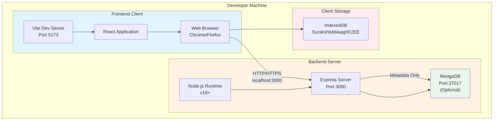

### 6.2 Deployment Flow

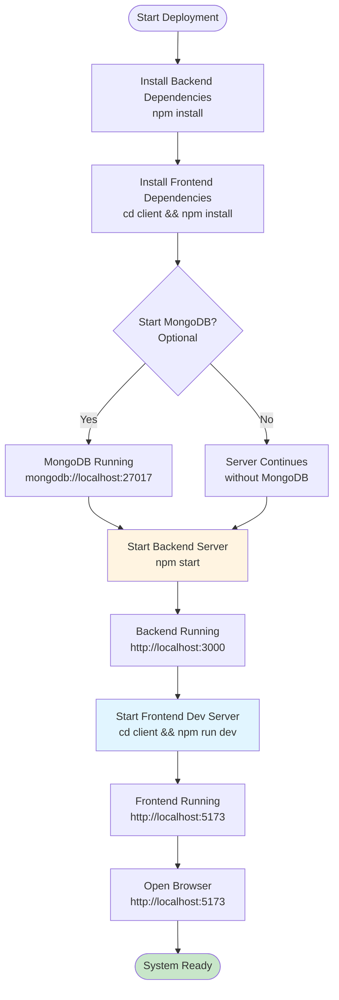

### 6.3 Network Architecture (Local)

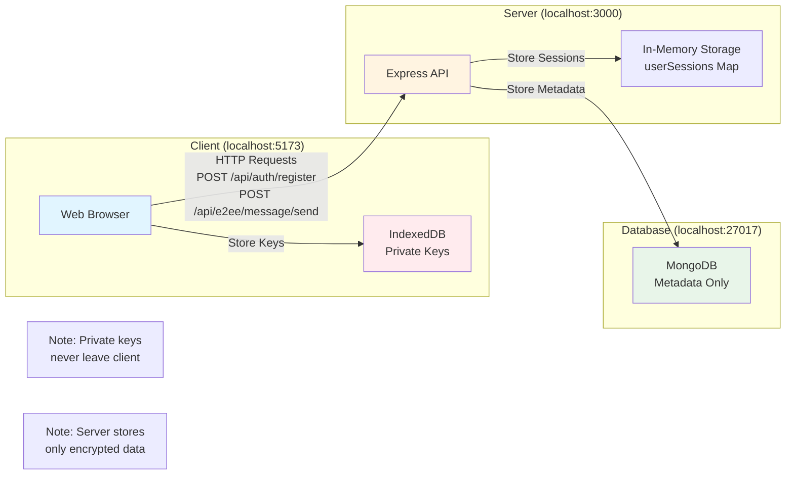

### 6.4 Component Interaction Diagram

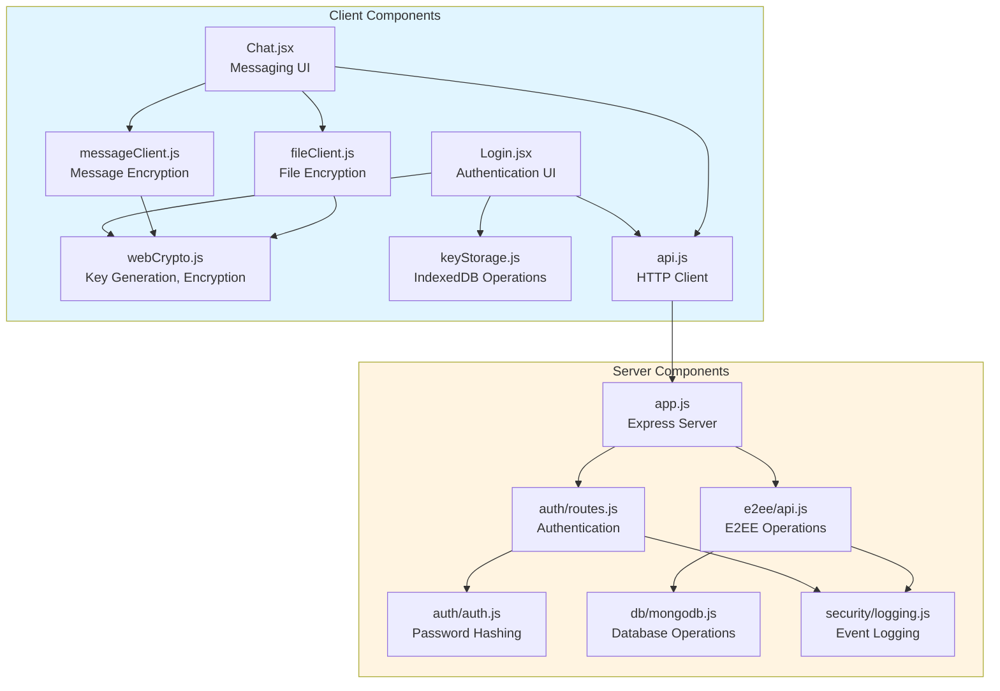

---

## Diagram Usage

These Mermaid diagrams can be:
1. **Rendered in Markdown viewers** (GitHub, GitLab, VS Code with Mermaid extension)
2. **Exported to images** using Mermaid CLI or online tools
3. **Included in PDF reports** by converting to images
4. **Embedded in documentation** websites

All diagrams are based on the actual codebase implementation.

